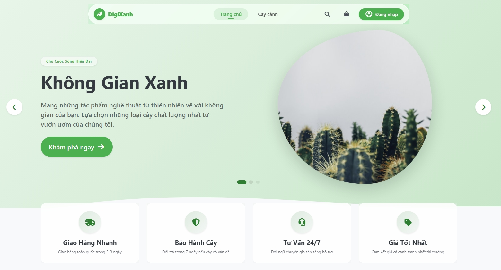
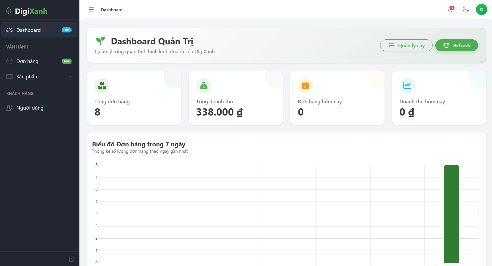
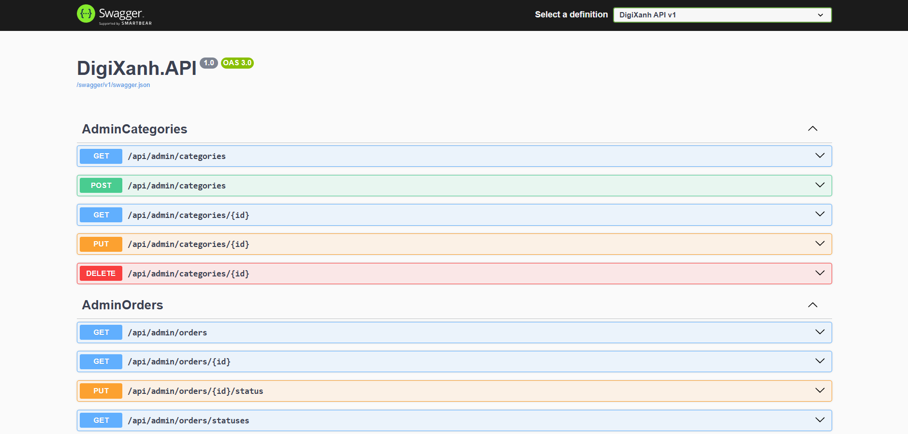

# 🌱 DigiXanh - Website Thương Mại Điện Tử Bán Cây Xanh

[](https://tienxdun.github.io/DigiXanh/)
[](https://digixanh.onrender.com/swagger)
[](#)
[](#)
[](#)

> Đây là một **Full-stack E-commerce Application** tôi xây dựng từ những viên gạch đầu tiên. Dự án ứng dụng mô hình kiến trúc phân tách độc lập Frontend/Backend (API-based) và áp dụng các tiêu chuẩn kỹ thuật trong ngành công nghiệp phần mềm: **OOP, Clean Architecture, Design Patterns**.

---

## 📷 Giao Diện Trực Quan (Actual UI Preview)

### Kênh Mua Sắm Khách Hàng (Customer Portal)
*Trải nghiệm web mượt mà được phát triển trên nền tảng Angular 21:*


### Trang Quản Trị Hệ Thống (Admin Dashboard)
*Giao diện quản lý trực quan với biểu đồ Analytics:*


### Tài Liệu API (Swagger Documentation)
*Hệ thống API được chuẩn hóa và tài liệu hóa bằng Swagger UI:*


---

## 🏗️ Kiến Trúc Hệ Thống (System Architecture)

Dự án được tôi thiết kế với tư duy chia nhỏ module logic để dễ dàng scale-up và bảo trì (maintainability):

```ascii
┌────────────────────────────────────────────────────────────┐
│   🌐 Frontend (Angular 21)         ⚙️ Backend (.NET 8)      │
│   ├─ Customer Portal (SPA)         ├─ RESTful API          │
│   ├─ Admin Dashboard (CoreUI)      ├─ JWT / Auth Flow      │
│   └─ Mobile Responsive             ├─ SQL Server Database  │
│                                    └─ VNPay Integration    │
└────────────────────────────────────────────────────────────┘
```

---

## 💻 Tech Stack & Kỹ Năng Kỹ Thuật (Engineering Toolkit)

### Frontend Engine (UI/UX)
*   **Framework**: Angular 21.1.5+ (Standalone Components, DI, Lazy Loading)
*   **Ngôn ngữ**: TypeScript 5.9 (Strict Type-safe)
*   **State Management / Reactive**: RxJS 7.8
*   **UI Components**: CoreUI 5.6 & SCSS / BEM
*   **Testing**: Vitest 4.0 (Unit TDD), Cypress 13 (E2E)

### Backend Services (Core System)
*   **Framework**: ASP.NET Core 8.0 (Web API)
*   **ORM Layer**: Entity Framework Core 8.0 (Code-First Migration)
*   **Database**: Microsoft SQL Server 2022
*   **Testing**: xUnit 2.4 (Unit testing & Mocking)

### DevOps & Infrastructure
*   **CI/CD Pipeline**: Tự động hoá quá trình test và build với GitHub Actions.
*   **Hosting Provider**: Render (Backend APIs) + GitHub Pages (Frontend Hosting).

---

## ✨ Điểm Nhấn Công Nghệ & Tư Duy (Technical Highlights)

Để giải quyết các bài toán hóc búa về quy trình nghiệp vụ phần mềm E-commerce, tôi đã trực tiếp áp dụng linh hoạt các **Design Patterns** (GoF) vào hệ thống:

| Tên Design Pattern (GoF) | Vị Trí Áp Dụng | Lợi Ích & Giải pháp (Trade-offs) |
|--------------------------|----------------|----------------------------------|
| **Adapter Pattern**      | Payment Gateway | Dễ dàng tương thích, tích hợp hoặc thay thế các cổng thanh toán mới (như VNPay, MoMo) mà không làm rạn nứt logic core của hệ thống. |
| **Decorator Pattern**    | Discount Engine | Cho phép cộng dồn (stack) nhiều luật giảm giá độc lập một cách linh động (run-time) hỗ trợ mạnh mẽ các chiến dịch marketing. |
| **Facade Pattern**       | Checkout Flow  | Cung cấp một gateway thống nhất để đóng gói các quy trình phức tạp (kiểm tra tồn kho, tính giá, gọi API thanh toán) giúp client-side dễ dàng kết nối mà không bị Coupling với backend. |
| **Repo + Unit of Work**  | Data Access    | Quản lí toàn vẹn Transaction (ACID). Đảm bảo rollback an toàn, tránh Data Anomaly hay Race Condition trong quá trình xử lý đơn hàng khối lượng lớn. |

---

## 🛡️ Tiêu Chuẩn Bảo Mật & Bảo Vệ Dữ Liệu
*   Trao đổi luồng dữ liệu an toàn thông qua **JWT Authentication** với cơ chế nâng cao Refresh / Access Token.
*   Xây dựng hệ thống phân quyền nhiều cấp độ (**Role-based Authorization**) kiểm soát rủi ro truy cập trái phép.
*   Tích hợp các pattern phòng thủ tiêu chuẩn nhằm chống lại các tấn công **XSS**, **SQL Injection** và **CSRF**.

---

## 📞 Liên Hệ & Thảo Luận
Tôi luôn sẵn sàng để chia sẻ & thảo luận sâu hơn về tư duy kiến trúc và những trade-offs đã được cân nhắc để thiết kế ra DigiXanh. Sự trao đổi 2 chiều chính là điều tôi mong muốn.

* 🌐 **Live Trải Nghiệm**: [https://tienxdun.github.io/DigiXanh/](https://tienxdun.github.io/DigiXanh/)
* 💻 **Mã Nguồn GitHub**: [https://github.com/TienxDun/DigiXanh](https://github.com/TienxDun/DigiXanh)

---
*Cảm ơn đã dành thời gian review source code của tôi.*
